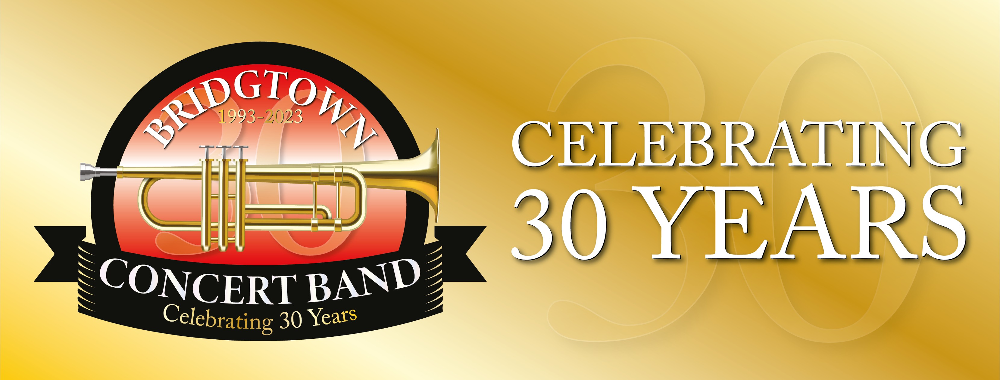

  # 

### Contact Information
- **GitHub:** [Cazbella](https://github.com/Cazbella)
- **Email:** cazbella@myyahoo.co.uk

## Table of Contents
- [Description](#description)
- [Installation](#installation)
- [Usage](#usage)
- [Contributing](#contributing)
- [Questions](#questions)

## Description

Find the deployed application here: 

https://bridgtown-concert-band.netlify.app

Welcome to the Bridgtown Concert Band's official website! This site serves as a central hub for all things related to our band, including upcoming events, news, membership information, and more. Our mission is to provide exceptional musical experiences for our members and audiences alike, fostering a love for music in our community.

# Features

Upcoming Events
Stay up-to-date with our latest performances and events. Our calendar provides information on upcoming concerts, rehearsals, and special events. Join us for an unforgettable musical experience!

#### News and Updates
Get the latest news and updates from the Bridgtown Concert Band community. From concert reviews to band announcements, our news section keeps you informed about all the happenings within our organization.

#### Membership Information
Interested in joining our band? Learn more about our membership requirements, rehearsal schedule, and audition process. Whether you're an experienced musician or a beginner, there's a place for you in our ensemble.

#### Contact Us
Have questions or feedback? Get in touch with us! Our contact page provides various ways to reach out, including email, phone, and social media. We'd love to hear from you!

#### Get Involved

We welcome musicians of all ages and skill levels to join our band. Whether you play woodwind, brass, or percussion instruments, there's a spot for you in our ensemble. Join us for rehearsals, performances, and camaraderie as we make music together!

#### Visit Our Website

Ready to explore the world of Bridgtown Concert Band? Visit our website at https://bridgtown-concert-band.netlify.app and discover the joy of music with us!

## Technologies Used

The Bridgtown Concert Band website was built using modern web technologies to deliver an immersive and interactive user experience. At its core, the website leverages the power of React, a popular JavaScript library for building user interfaces. React's component-based architecture allows for the creation of reusable UI elements, resulting in a modular and maintainable codebase. The website also utilizes HTML5 and CSS3 for structuring and styling the content, ensuring compatibility across various web browsers and devices. Additionally, to enhance the dynamic nature of the site, JavaScript was employed for implementing interactivity and handling user interactions. The deployment and hosting of the website are powered by Netlify, providing a seamless and reliable platform for delivering content to users worldwide. With these cutting-edge technologies, the Bridgtown Concert Band website offers a seamless blend of functionality, aesthetics, and performance, providing visitors with an engaging musical journey.

## Installation
Installation:
1. Clone the repository: git clone https://github.com/cazbella/bridgtown-concert-band
2. Navigate to the project directory: cd bridgtown_concert_band
3. Install dependencies: npm install
4. Start the development server: npm start

Visit http://localhost:3000 to view the app in your browser.

**Dependencies:**
- `@fortawesome/fontawesome-free`: ^6.5.1
- `@fortawesome/fontawesome-svg-core`: ^6.5.1
- `@fortawesome/free-brands-svg-icons`: ^6.5.1
- `@fortawesome/free-solid-svg-icons`: ^6.5.1
- `@fortawesome/react-fontawesome`: ^0.2.0
- `@popperjs/core`: ^2.11.8
- `bootstrap`: ^5.3.2
- `react`: ^18.2.0
- `react-dom`: ^18.2.0
- `react-router-dom`: ^6.10.0

**DevDependencies:**
- `@types/react`: ^18.2.43
- `@types/react-dom`: ^18.2.17
- `@vitejs/plugin-react`: ^4.2.1
- `eslint`: ^8.55.0
- `eslint-plugin-react`: ^7.33.2
- `eslint-plugin-react-hooks`: ^4.6.0
- `eslint-plugin-react-refresh`: ^0.4.5
- `vite`: ^5.0.10

## Usage

Upon loading you can click on 'Home' and see the home page.

Use the buttons in the navigation bar to explore the pages.

## Contributing
Contributions to this project are welcome and encouraged! If you have ideas for new features, find a bug, or want to improve the documentation, feel free to contribute. To contribute to the project fork the repository on GitHub. Clone your forked repository to your local machine. Create a new branch with a descriptive name for your contribution: git checkout -b feature/new-feature or git checkout -b bug/fix-bug. Then make your changes and commit them with a clear message. Push your changes to your forked repository and open a pull request in the main repository with a detailed description of your changes. Please follow the project's coding style and adhere to the existing conventions. By contributing, you agree that your contributions will be licensed under the project's license. Thank you for helping make my website better!
